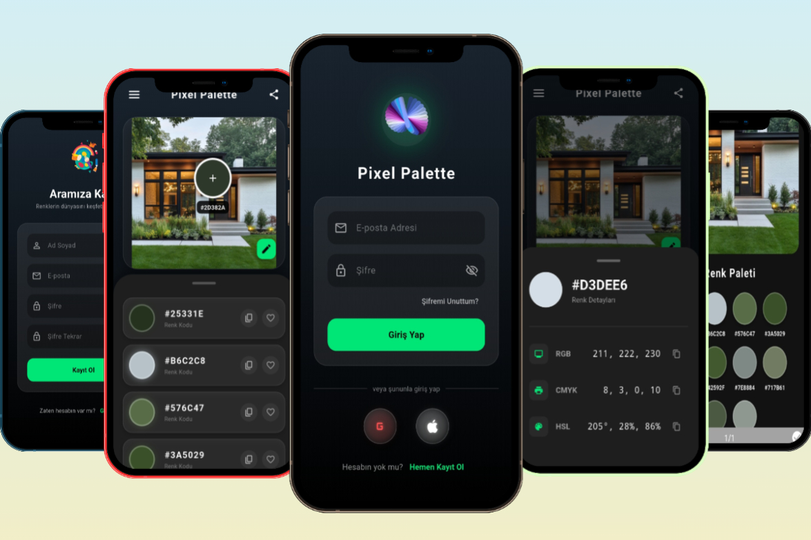

<div align="center" style="position: relative; text-align: center; color: white;">
    
    <div style="position: absolute; top: 50%; left: 50%; transform: translate(-50%, -50%); width: 90%; padding: 20px; background-color: rgba(0, 0, 0, 0.3); border-radius: 15px;">
        <h1 style="color: white; font-size: 3.5vw; font-weight: bold; margin-bottom: 10px; text-shadow: 2px 2px 8px rgba(0,0,0,0.7);">🎨 Pixel Palette</h1>
        <p style="color: #f8f8f8; font-size: 1.8vw; font-weight: 500; text-shadow: 1px 1px 4px rgba(0,0,0,0.7);">Discover the soul of your photos through colors.</p>
    </div>
</div>

<br>

Pixel Palette is a modern mobile application developed with **Flutter** that extracts aesthetic and dominant color palettes from photos in your gallery.

Unlike ordinary color picker apps, Pixel Palette focuses on the **visual experience**. It offers users a visual feast with its **Glassmorphism** (frosted glass) design language, cinematic gradient backgrounds, and fluid **Lottie animations**.

---

## ✨ Key Features

Pixel Palette is not just a technical tool, but also a design experience.

### 🧠 Smart Color Analysis
* **Automatic Palette Extraction:** Instantly analyzes any uploaded photo and lists the top 10 dominant colors.
* **Precision Pipette Tool (Magnifier):** Capture the exact RGB/Hex value of pixels by dragging your finger over the photo with a magnifier.
* **Locate Color Occurrences:** Long-press a color in the list to visually highlight where that color appears in the photo.

### 💎 Modern and Cinematic UI/UX
* **Glassmorphism Design:** Menus, cards, and buttons are designed as translucent frosted glass panels floating over the background.
* **Dynamic Backgrounds:** Dark-themed cinematic gradient transitions that provide a sense of depth throughout the app.
* **Fluid Animations:** Drawer menu and transitions enhanced with custom Lottie animations.
* **Interactive Buttons:** Special button designs that glow with RGB light effects, responsive to touch and (on desktop) mouse movements.

### 🚀 Other Functions
* **Favorites System:** Save the colors you like and access them quickly later from the "Favorites" page.
* **Share Mode:** Share the generated palette and photo on social media via a specially designed card.
* **Modern Login/Register:** Animated and secure authentication screens consistent with the project's general design language.

---

## 🛠️ Technologies and Packages Used

This project was developed using **Flutter** and **Dart**, adhering to clean architecture principles.

* **Framework:** [Flutter](https://flutter.dev/) (with Dart language)
* **Color Analysis:** `palette_generator`
* **Animations:** `lottie`
* **Image Processing:** `image`, `image_picker`
* **State Management:** `setState` (Optimized for project scale)
* **File & Sharing:** `path_provider`, `share_plus`

---

## 🚀 Installation and Setup

Follow the steps below to run this project on your local machine:

**Prerequisites:** You must have the [Flutter SDK](https://docs.flutter.dev/get-started/install) installed on your computer.

1.  **Clone the Project:**
    ```bash
    git clone [https://github.com/UnalPilavci/Pixel-Palette.git](https://github.com/UnalPilavci/Pixel-Palette.git)
    ```

2.  **Enter the Project Directory:**
    ```bash
    cd pixel-palette
    ```

3.  **Install Dependencies:**
    ```bash
    flutter pub get
    ```

4.  **Run the Application:**
    Run the following command while an emulator or real device is connected:
    ```bash
    flutter run
    ```

---

## 🗺️ Roadmap (Future Plans)

Pixel Palette continues to evolve. Here are some features planned for future releases:

* [ ] **Permanent Data Storage (Hive):** Remembering favorite colors even after the app is closed.
* [ ] **Color Accessibility Check:** Testing the suitability of white or black text over selected colors (WCAG standards).
* [ ] **Color Blindness Simulation:** Filters showing how the palette is perceived by color-blind users.
* [ ] **Firebase Integration:** Real user registration and cloud storage.

---

## 👨‍💻 Developer

This project was developed by **Ünal Pilavcı**.

* **LinkedIn:** [Ünal Pilavcı](https://www.linkedin.com/in/%C3%BCnal-p-a7bb2a24a/)
* **Email:** [unal.plvc38@gmail.com](mailto:unal.plvc38@gmail.com)

---

This project was developed with ❤️. If you like our vision, feel free to support us by leaving a Star (⭐)!
